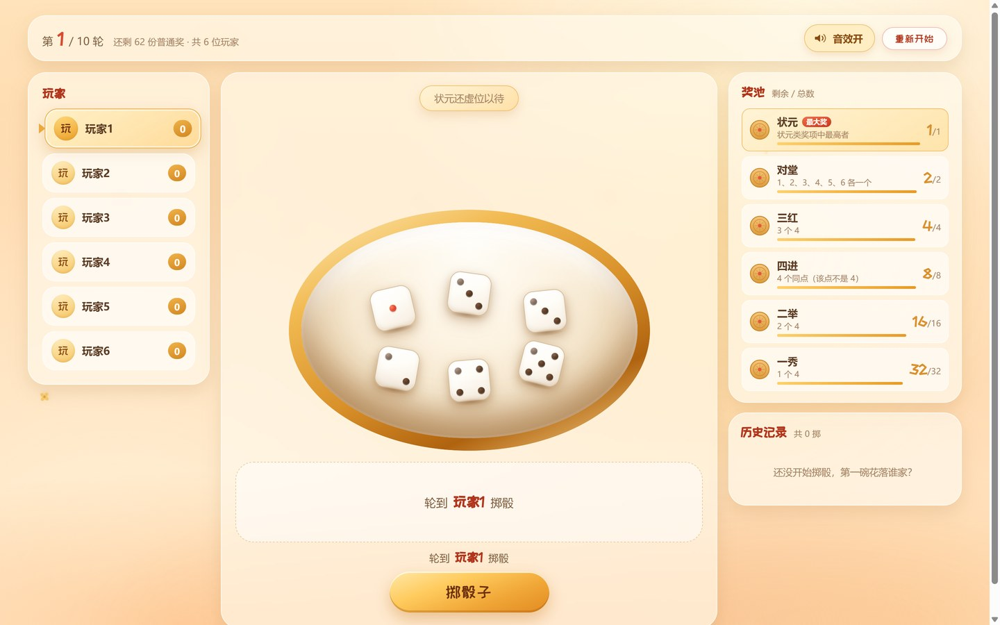
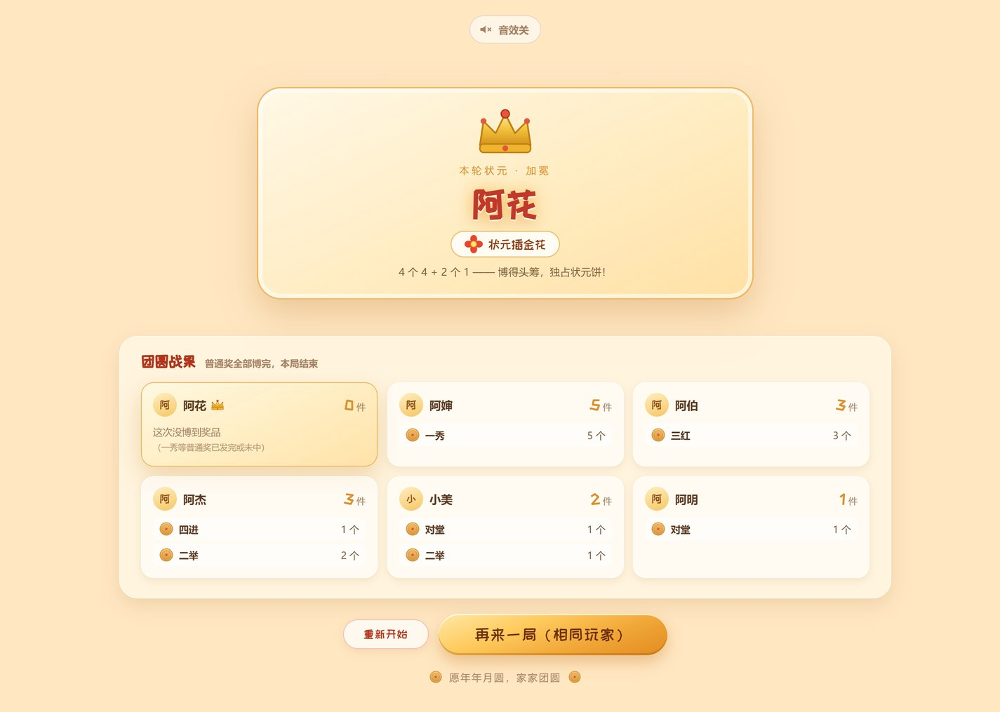
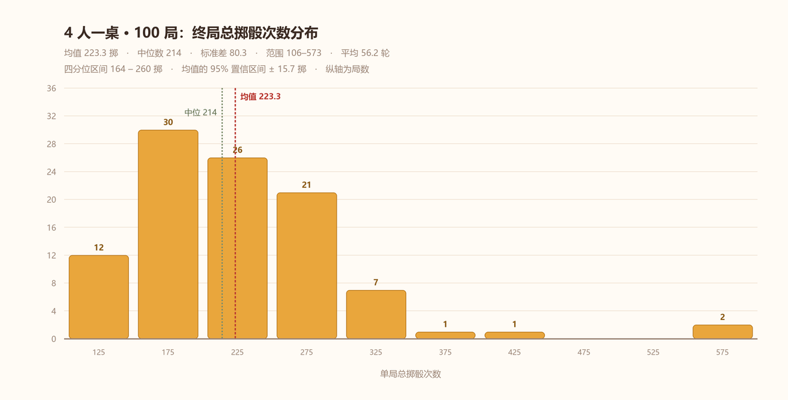
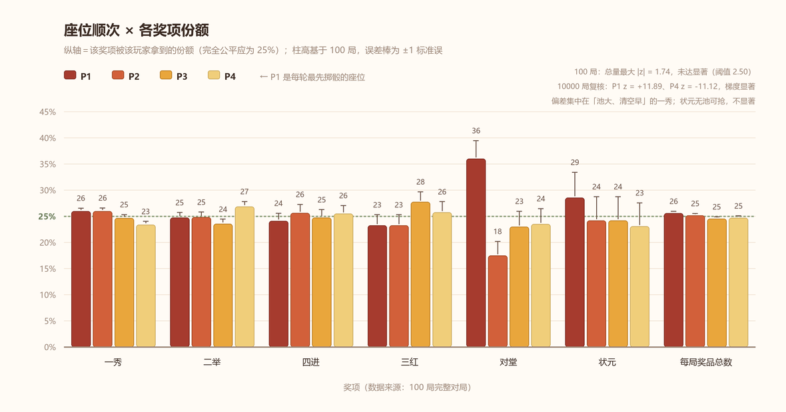
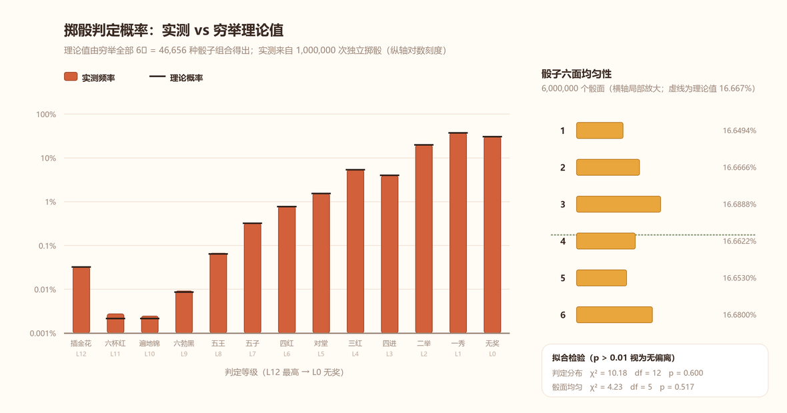

<div align="center">


# 闽南中秋博饼模拟器

**六颗骰子一只碗，一家人围坐争状元。**

一个纯单机离线的浏览器应用，完整实现「厦门常见规则」的博饼玩法。

### [🎲 在线试玩 →](https://kenneth-g6.github.io/minnan-bobing/)

[](./LICENSE)
[](https://github.com/Kenneth-G6/minnan-bobing/actions/workflows/ci.yml)
[](https://github.com/Kenneth-G6/minnan-bobing/actions/workflows/pages.yml)


[功能特性](#功能特性) · [快速开始](#快速开始) · [玩法](#玩法) · [规则](#规则) · [技术实现](#技术实现) · [测试](#测试) · [统计实验](#统计实验)

</div>

---

## 界面预览

| 开始界面 | 游戏主界面 |
| :---: | :---: |
|  |  |

| 掷骰结果 | 历史记录 | 结算界面 |
| :---: | :---: | :---: |
|  |  |  |

---

## 功能特性

- **完整规则实现** —— 13 级奖项判定链、状元比较、奖池递减、轮次推进、自动结算，全部按「厦门常见规则」写死，无地方差异配置
- **规则与界面彻底解耦** —— 核心判定抽成纯函数，零 UI 依赖、可注入随机源，规则改动不需要碰组件
- **离线可跑** —— 零后端、零运行时网络请求、无 CDN 外链，`dist/` 断网双击即玩
- **中秋团圆氛围** —— 红灯笼、玉兔、桂花、月饼、博饼碗等装饰全部手绘内联 SVG；骰子旋转弹跳逐个落碗、奖项放大弹出带金色光效、状元加冕动画
- **可选音效** —— WebAudio 实时合成掷骰声 / 中奖声 / 状元锣声，默认开启，可随时关闭并记住偏好
- **响应式与无障碍** —— 适配窄屏单列布局，遵循系统「减少动态效果」偏好

---

## 快速开始

### 环境要求

| 项目 | 要求 |
| :--- | :--- |
| Node.js | ≥ 18（开发使用 v22） |
| 浏览器 | Chrome / Edge / Safari / Firefox 近两年版本 |

### 安装与运行

```bash
git clone https://github.com/Kenneth-G6/minnan-bobing.git
cd minnan-bobing
npm install
npm run dev
```

浏览器打开终端提示的地址（默认 <http://localhost:5173>）即可开始。

### 常用脚本

| 命令 | 说明 |
| :--- | :--- |
| `npm run dev` | 启动开发服务器（Vite HMR） |
| `npm run build` | 类型检查 + 生产构建，产物输出到 `dist/` |
| `npm run preview` | 本地静态预览构建产物 |
| `npm test` | 运行全部单元测试（Vitest，单次执行） |
| `npm run test:watch` | 监听模式运行测试 |

构建后 `dist/` 为纯静态资源，可直接用任意静态服务器托管，或断网双击 `dist/index.html` 运行。

### 在线访问

应用已部署到 GitHub Pages：<https://kenneth-g6.github.io/minnan-bobing/>

推送 `main` 分支后由 [`.github/workflows/pages.yml`](.github/workflows/pages.yml) 自动完成构建与发布（类型检查 → 测试 → 构建 → 部署）。Fork 之后在自己的仓库 `Settings → Pages` 把 Source 设为 **GitHub Actions**，即可得到同样的站点。

<details>
<summary><b>关于 <code>.npmrc</code> 国内镜像</b></summary>

仓库自带 `.npmrc` 指向 `registry.npmmirror.com`，用于国内网络下更稳定的安装。若不需要可删除该文件，改用官方源：

```bash
npm install --registry=https://registry.npmjs.org
```

</details>

---

## 玩法

### 开始界面

1. 调整**玩家人数**（2–12 人，默认 6 人），可用「−/+」按钮或滑块
2. （可选）填写玩家姓名，留空自动使用「玩家N」
3. （可选）右上角切换**音效开关**，默认开启并记住选择
4. 点击 **开始博饼**；想先看规则可展开「看看规则速览」

### 游戏主界面

- 左侧列表显示全部玩家，**当前行动玩家高亮**，状元带皇冠标记
- 中央是博饼碗，点击 **掷骰子** 后 6 颗骰子在碗上方旋转弹跳、逐个落入碗中并定格（约 1.2s）
- 动画期间按钮禁用，防止连点导致状态错乱
- 动画结束后结果区放大弹出奖项，并提示以下之一：
  - `恭喜中奖 · XX`（普通奖成功发出）
  - `XX 已满，无奖`（奖池发完，**不顺延**）
  - `成为当前状元` / `替换当前状元` / `未超过当前状元`
- 右侧上方为奖池（月饼卡片显示 剩余/总数），下方为历史记录（轮次 / 玩家 / 骰子 / 奖项）
- 顶栏可随时切换音效，或「重新开始」（有二次确认，避免误触丢失本局记录）

### 结算界面

- 状元加冕动画（皇冠落下 + 金粉飘落 + 欢庆音效）
- 「团圆战果」逐位列出奖品清单与数量，状元卡片优先排在最前
- **重新开始** 回到开始界面；**再来一局（相同玩家）** 沿用名单直接开局

---

## 规则

> 以下为写死的默认版本，从高到低匹配，**命中最高奖项后立即停止**。

### 奖项判定表

| 等级 | 奖项 | 骰子组合 |
| :---: | :--- | :--- |
| 12 | 状元插金花 | 4 个 4 + 2 个 1 |
| 11 | 六杯红 | 6 个 4 |
| 10 | 遍地锦 | 6 个 1 |
| 9 | 六勃黑 | 6 个 2 / 3 / 5 / 6 |
| 8 | 五王 | 5 个 4 |
| 7 | 五子 | 5 个同点，且该点不是 4 |
| 6 | 四红 | 4 个 4，且不是状元插金花 |
| 5 | 对堂 | 1、2、3、4、5、6 各一个 |
| 4 | 三红 | 3 个 4 |
| 3 | 四进 | 4 个同点，且该点不是 4 |
| 2 | 二举 | 2 个 4 |
| 1 | 一秀 | 1 个 4 |
| 0 | 无奖 | 其他组合 |

**易错点**（均有测试覆盖）：

- `4,4,4,4,1,1` 是状元插金花，**不是**四红
- `1,2,3,4,5,6` 是对堂，**不是**一秀
- `5,5,5,5,5,6` 是五子，**不是**四进
- 六个 1 是遍地锦，**不是**六勃黑
- 四进排除四个 4；五子排除五个 4

### 奖品数量

一秀 32 · 二举 16 · 四进 8 · 三红 4 · 对堂 2 · 状元 1

### 普通奖发放

一秀 / 二举 / 四进 / 三红 / 对堂：**先到先得**，奖池有货就发并减 1；池空则本次记「该奖项已满，无奖」，**绝不向下顺延**（对堂发完不能改拿三红）。

### 状元比较

系统维护一个「当前状元」：

- 第一个掷出状元类奖项的玩家成为当前状元，后续**更大的替换、更小或完全相等的保持不变**（相等先到先得）
- 同等级比较键：
  - **状元插金花 / 六杯红 / 遍地锦** —— 唯一，先到先得
  - **六勃黑** —— 比六同点数值（6 > 5 > 3 > 2）
  - **五王** —— 比剩余一颗骰子点数
  - **五子** —— 先比五同点点数，再比剩余一颗骰子
  - **四红** —— 比剩余两骰的降序序列（如 `[6,5] > [6,3] > [5,5]`）

### 结束与结算

- 五个普通奖池全为 0 → 游戏结束（状元池不参与「池空」判定）
- **轮数不设上限**，一局会一直博到五个普通奖发完为止；顶栏轮次仅用于展示进度
- 结束时当前状元获得状元奖品；状元为空则**状元空缺**，奖品不发

> 终局由**最慢清空**的奖池决定：一局平均约 **220 掷**（实测 4 人 223 掷 ≈ 56 轮），而**这个数字与人数无关**——人多只是把同样的掷骰摊成更少的轮数（详见[统计实验](#统计实验)）。中后段约 40% 的掷骰是「已满，无奖」的空掷，属预期表现。

---

## 技术实现

### 技术栈

TypeScript 5 · React 18 · Vite 5 · Vitest 2 · 纯 CSS（无 UI 库 / CSS 框架）

### 项目结构

```
minnan-bobing/
├── index.html
├── package.json / tsconfig.json / vite.config.ts / .npmrc
├── LICENSE / README.md
├── .github/workflows/ci.yml     # CI：类型检查 + 测试 + 构建
├── public/                      # 静态资源预留目录
├── docs/screenshots/            # 界面截图
├── docs/analysis/               # 统计实验的图表与原始数据
└── src/
    ├── main.tsx                 # 挂载入口
    ├── App.tsx                  # 三阶段编排：开始 → 游戏 → 结算
    ├── styles.css               # 全部样式与动画
    ├── sound.ts                 # WebAudio 音效引擎 + 开关偏好持久化
    ├── assets/fonts/            # 本地化字体（站酷快乐体，SIL OFL）
    ├── core/                    # ★ 纯逻辑层，零 UI 依赖
    │   ├── types.ts             # 类型、奖项元数据、奖池常量
    │   ├── rules.ts             # judgeRoll() 判定 + compareRolls() 比较
    │   ├── random.ts            # 可注入随机源 + 测试用确定性随机源
    │   ├── engine.ts            # 状态机：发奖 / 状元更替 / 轮次 / 结算
    │   └── __tests__/
    │       ├── rules.test.ts        # 判定表与比较器（37 项）
    │       ├── engine.test.ts       # 状态机与不变量（26 项）
    │       └── app.smoke.test.tsx   # 界面端到端冒烟（10 项）
    └── components/
        ├── StartScreen.tsx / GameScreen.tsx / EndScreen.tsx
        ├── DiceBowl.tsx / Die.tsx           # 博饼碗与骰子
        ├── PlayerList.tsx / PrizePool.tsx / HistoryLog.tsx
        ├── SoundToggle.tsx
        └── Decor.tsx                        # 中秋装饰 SVG（手绘内联）
```

### 分层约定

**规则全部集中在 `src/core/`，UI 组件不含任何判定逻辑。** 组件只调用 `core` 暴露的接口；规则改动只需修改 `core` 并跑测试，UI 无需变动。

### 核心 API

```ts
// 判定单次掷骰
judgeRoll(dice: number[]): RollResult
// RollResult = { prizeKey, prize, level, type: 'normal' | 'zhuangyuan' | 'none', tiebreak, desc }

// 比较两次掷骰（用于状元更替）：> 0 表示 a 更大，0 表示完全相等
compareRolls(a: RollResult, b: RollResult): number

// 创建一局 / 执行一掷（返回新状态，不可变更新）
createGame(names: string[]): GameState
rollOnce(state: GameState, random?: RandomFn): { state: GameState; outcome: RollOutcome }
```

随机源可注入，测试用 `diceSequenceRandom([[4, 4, 4, 4, 1, 1]])` 构造确定性骰子序列。

---

## 测试

```bash
npm test
```

共 **73 项**全部通过：

| 测试文件 | 覆盖内容 |
| :--- | :--- |
| `rules.test.ts`（37 项） | 13 条指定用例（含 `六勃黑-6`、`四进-1`、`五子-5` 的比较键断言）与边界 `[2,2,2,2,2,2]`、`[6,6,6,6,6,5]`、`[4,4,4,4,1,2]`、`[1,1,1,1,2,2]`、对堂各种排列；比较器六勃黑 6>5>3>2、五王比余骰、五子两级比较、四红降序序列、唯一奖项相等返回 0、非法输入抛错 |
| `engine.test.ts`（26 项） | 普通奖先到先得与池空不顺延、状元成为 / 替换 / 相等不替换、**不设轮数上限**（连续 30 轮无奖仍不结束）与「普通奖池全空是唯一结束条件」、结算状元领奖或空缺、2 人与 12 人边界，以及 60 组确定性随机整局模拟的不变量校验（结束后普通奖池必为空、奖品不超上限、结论完备、状元至多 1 个） |
| `app.smoke.test.tsx`（10 项） | jsdom 下真实挂载渲染，走完「开始 → 掷骰 → 结算 → 重开」全流程；结束条件收窄后改为注入确定性骰子序列（第 1 掷插金花，其后 62 掷恰好清空五个普通奖池），并断言轮次只累加不封顶、全程无 React 运行时错误 |

---

## 统计实验

把规则跑成数据。**4 人一桌 × 100 局**完整对局，随机种子固定为 `seed=20260925`，结果可完全复现；作为对照的理论概率由**穷举全部 6⁶ = 46,656 种骰子组合**得出，不是模拟值。

### 一局要掷多少次



| 平均 | 中位 | 四分位区间 | 单局范围 | 标准差 | 平均轮数 | 池满落空占比 |
| ---: | ---: | ---: | ---: | ---: | ---: | ---: |
| **223.3 掷** | 214 | 164 – 260 | 106 – 573 | 80.3 | 56.2 轮 | 39.7% |

单局极差 **467 掷**，达到标准差的 5.8 倍——一局快慢几乎全看「手气周期」，规则本身没有加速手段。

### 座位顺序与获奖



| 座位 | P1 | P2 | P3 | P4 |
| :--- | ---: | ---: | ---: | ---: |
| 100 局 · 每局奖品数 | 16.11 | 15.83 | 15.43 | 15.54 |
| 100 局 · z 值 | +1.74 | +0.43 | −1.24 | −0.77 |
| 1 万局 · 每局奖品数 | 15.993 | 15.829 | 15.602 | 15.479 |
| 1 万局 · z 值 | **+11.89** | **+4.58** | **−5.52** | **−11.12** |

- **先手优势真实存在，但小到可以忽略**：1 万局下梯度严格单调，P1 每局比 P4 多 0.51 件（+1.70% vs −1.57%）；而 **100 局根本测不出这个效应**——最大 |z| 只有 1.74，远低于阈值 2.50。
- **偏差集中在「池大、清空早」的奖项**：一秀（32 个，约前 90 掷清空）四人极差 0.294 件、|z| = 7.78；二举 0.140 / 4.86；三红 0.055 / 3.37、四进 0.047 / 2.12、对堂 0.023 / 2.14 只剩临界水平；**状元 0.012 / 1.84 完全不显著**——状元是「大小更替制」而非先到先得的额度争夺，没有可抢的池子。
- 机制：轮转掷骰使每人累计掷骰数最多只差 1 次，池子清空得越早，这 1 次之差被放大的比例越高；再加上「先手手气好 → 池子更早满 → 后手机会更少」的正反馈，就形成了这条细微却稳定的顺次梯度。

### 掷骰判定分布



| 奖项 | 理论概率 | 实测频率 | 绝对偏差 |
| :--- | ---: | ---: | ---: |
| 一秀 | 37.2942% | 37.3291% | +0.035 pt |
| 二举 | 19.9331% | 19.8756% | −0.058 pt |
| 三红 | 5.3584% | 5.3635% | +0.005 pt |
| 四进 | 4.0188% | 3.9925% | −0.026 pt |
| 对堂 | 1.5432% | 1.5431% | −0.000 pt |
| 四红 | 0.7716% | 0.7814% | +0.010 pt |
| 无奖 | 30.6499% | 30.6762% | +0.026 pt |
| **全部 13 级** | 100% | χ² = 10.18，df = 12，**p = 0.600** | ✅ 与理论一致 |

骰子六个面的出现频率偏离 1/6 均不足 0.03 个百分点（χ² = 4.23，df = 5，p = 0.517）。**随机源未发现可察觉偏差。**

### 顺带一个结论：一局掷骰总数与人数无关

| 人数 | 2 | 6 | 8 | 12 |
| :--- | ---: | ---: | ---: | ---: |
| 每局平均掷骰数（各 300 局） | 216.3 | 216.3 | 216.3 | 216.3 |
| 折合轮数 | 108.5 | 36.5 | 27.5 | 18.5 |

掷多少掷由「奖池容量 ÷ 命中率」决定，人数只决定这些掷骰摊成几轮。所以人多人少**一局的时长几乎不变**，变化的只是「每人轮到几次」。

> 完整数据（每级奖项明细、χ² 检验、骰子单面频率、1 万局复核）见 [统计实验报告](docs/analysis/report.md)，原始结果见 [simulation.json](docs/analysis/simulation.json)。统计脚本为本地一次性实验，未纳入仓库。

---

## 离线与素材

- **音效** —— WebAudio 程序化实时合成（掷骰碰撞、中奖铃声、状元锣声、加冕音阶）。零音频文件、零网络请求，不存在授权问题
- **字体** —— 站酷快乐体 ZCOOL KuaiLe（**SIL OFL 免费商用**），已本地化到 `src/assets/fonts/`，随构建打包
- **装饰** —— 月亮、玉兔、红灯笼、桂花、月饼、云纹、皇冠、红花全部为**手绘内联 SVG**，无外部图片
- **网络** —— 运行期**零网络请求**，无 CDN 外链，断网可正常运行

字体缺失或加载失败时自动回退到 `PingFang SC` / `Microsoft YaHei`，不会出现方块字。音效受浏览器自动播放策略限制，首次点击「开始博饼」时自动解锁音频。

### 构建产物体积

```
dist/assets/index-*.js      179 KB（gzip  58 KB）
dist/assets/index-*.css      30 KB（gzip   8 KB）
dist/assets/*CJK*.woff2     726 KB   ← 标题字体，本地托管（为支持任意中文姓名未做极致子集化）
```

> **关于标题字体的数字**：站酷快乐体是手绘感艺术字，其数字（尤其 `0`、`6`）刻意做成几何折角造型，视觉上略带方块感，这是**字体本身的设计**而非渲染故障。若希望数字更规整，将 `src/styles.css` 中的 `--font-title` 改为只保留系统字体即可。

---

## 浏览器兼容

| 浏览器 | 版本 |
| :--- | :--- |
| Chrome / Edge | ≥ 90 |
| Safari | ≥ 14 |
| Firefox | ≥ 90 |

依赖 CSS `backdrop-filter`（毛玻璃卡片）与 Web Audio API；不支持时自动降级为纯色卡片与静音，不影响玩法。

---

## 贡献

欢迎提交 Issue 与 Pull Request。

1. Fork 本仓库并新建分支：`git checkout -b feat/your-feature`
2. 保持 `src/core/` 的纯函数约定，规则相关改动请同步补充单元测试
3. 提交前确保 `npm test` 与 `npm run build` 均通过
4. 提交 PR 并说明改动动机

> 本项目按题目要求**固定实现「厦门常见规则」**，不接受地方规则差异的可配置化改动，以免判定逻辑复杂化。

---

## 许可证

本项目基于 [MIT License](./LICENSE) 开源。

内置标题字体「站酷快乐体 ZCOOL KuaiLe」遵循 [SIL Open Font License 1.1](src/assets/fonts/LICENSE-ZCOOLKuaiLe.txt)，可免费商用，版权归原作者所有。

<div align="center">

**中秋快乐，博个好彩头 🎲🥮**

</div>
